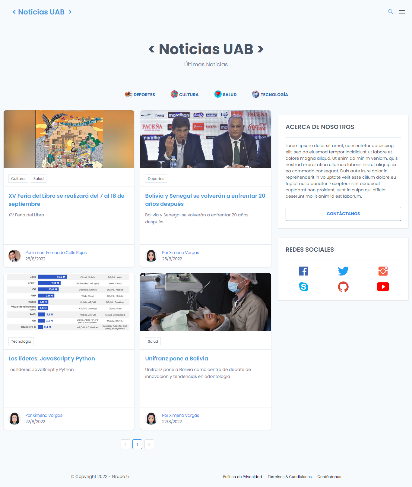
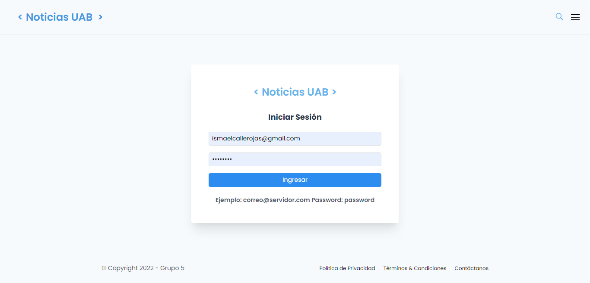
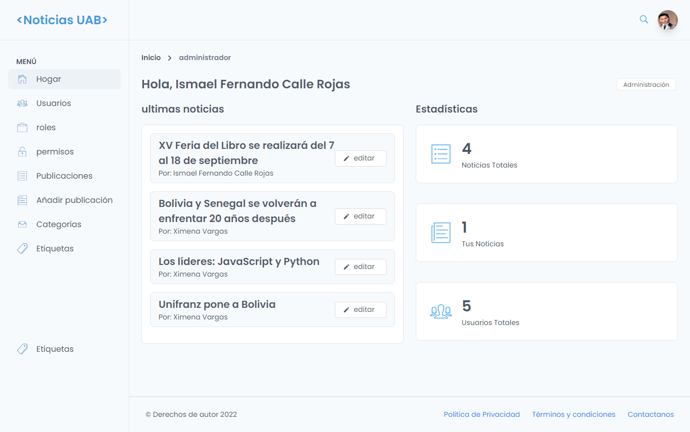
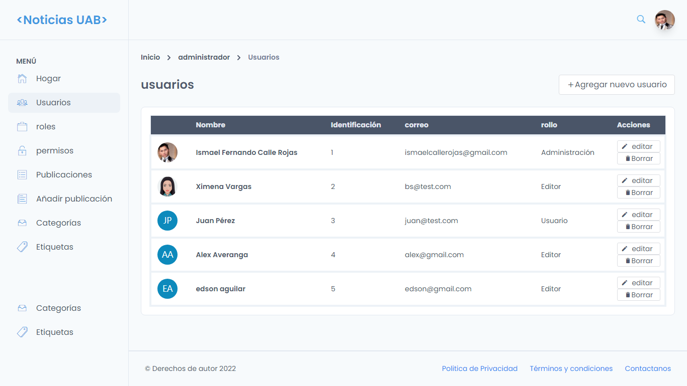

# Sistema de Noticias hecho en laravel con panel de administración:
Tienes las siguientes funcionalidades:

- Crear, Leer, Actualizar y Borrar Noticias,
- Crear, Leer, Actualizar y Borrar Categorias y etiquetas
- Gestion de Roles y Permisos,
- Administración de usuarios.

## Programas Necesarios:
- Servidor Local para PHP y MYSQL(XAMPP)
- Navegador Web
- Composer
- Node.js

## Instalación

1. Instalar las dependencia de Composer:
```
composer install
```
NOTA: Si se tiene Errores al instalar las dependencias de composer por la versión, ejecutar el siguiente comando:
```
composer update --ignore-platform-reqs
```
2. Instalar las dependencias de Node.js para VUE.JS:
```
npm install
```
3. Crear o Copiar el archivo .env file (copiar de env.example):
```
cp .env.example .env
```
4. Generar una clave de cifrado de aplicación:
```
php artisan key:generate
```
5. Crear una nueva base de datos para la aplicación..

6. En el archivo .env, agregue información de la base de datos para permitir que Laravel se conecte a la base de datos. 
En el archivo .env, complete las opciones DB_HOST, DB_PORT, DB_DATABASE, DB_USERNAME y DB_PASSWORD para que coincidan con las credenciales de la base de datos que acaba de crear..

7. Migrar la base de datos:
```
php artisan migrate
```

8. Sembrar datos falsos para poder loguearse:
```
php artisan db:seed --class=DatabaseSeeder
```

## Capturas
- Inicio


- Login


- Panel de administración


- Administración de Usuarios 
- 
